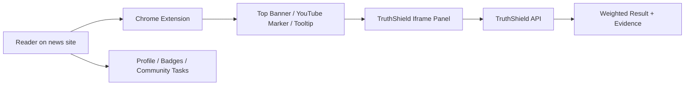

# TruthShield Web

TruthShield is an open-source news credibility layer for the web. It combines a public website, embeddable iframe panels, and a Chrome extension so readers can see weighted community labels, inspect evidence, and vote only after reading an article.

This repository contains the Vue frontend, public Truth Hub pages, iframe vote/status panels, extension assets, extension packaging script, and local demo pages.

> The extension stays lightweight. It detects news pages and injects only UI containers; authentication, voting, evidence submission, and trust-weighted behavior live in the TruthShield web iframe.

## What Users See

- A minimal top banner on supported news pages.
- A small YouTube marker instead of a heavy banner on YouTube videos.
- Hover tooltips that show only the highest-impact label and result summary.
- A vote/evidence panel opened from the banner, popup, or context menu.
- A profile page with trust score, badges, achievements, identity display, and contribution history.
- Public evidence library, transparency dashboard, media ranking, community tasks, donation page, and installation guide.

## Open Source Impact

TruthShield is built as public-interest infrastructure for news credibility and civic context. The project is not a content blocker and does not remove or censor external articles. Instead, it adds an auditable layer beside news content: weighted community labels, public evidence, reader reactions, event timelines, transparent moderation records, and governance logs.

The frontend is already used in production at:

- Web app: <https://truth-shield.otus.tw>
- API: <https://truth-shield-api.otus.tw>

This repository is the user-facing half of the system. It makes the open API visible through the public Truth Hub, embeddable iframe panels, Chrome extension UI, event pages, community tasks, evidence library, and transparency pages. The companion backend repository contains the trust-weighting engine, moderation records, event taxonomy, anti-abuse logic, and API implementation.

## Maintenance and Codex Use

TruthShield is actively maintained as a small open-source project. Recent work includes extension packaging, reader-reaction UX, event timelines, event categorization and progress status, achievement tiers, donation prompts, share previews, public documentation, and production deployment fixes.

Codex and API credits would be used for core open-source maintenance work:

- Review frontend and extension changes before release.
- Triage UI regressions from production feedback and browser-extension QA.
- Generate release checklists and changelogs for website and extension updates.
- Inspect accessibility, security, and privacy-sensitive frontend flows.
- Assist with issue triage, documentation updates, and public transparency copy.

## Product Flow



## Tech Stack

- Vite
- Vue 3 with `<script setup>`
- Tailwind CSS
- Chrome Extension Manifest V3
- iframe-based extension UI
- i18n for Traditional Chinese and English

## Key Routes

| Route | Purpose |
| --- | --- |
| `/` | Mission-driven Truth Hub home |
| `/login` | Dev login and OAuth entry UI |
| `/iframe-tooltip` | Lightweight tooltip iframe |
| `/iframe-vote-panel` | Article voting, evidence, official response, and results panel |
| `/demo-news` | Public interactive article demo for testing the extension user flow |
| `/local-news-demo` | Local-only article page for unpacked extension QA; production redirects to `/demo-news` |
| `/extension-install` | Extension download and sideload instructions |
| `/profile` | Trust score, badges, profile, identity claims, notifications |
| `/evidence-library` | Searchable public evidence library |
| `/community-tasks` | Community self-management task pool |
| `/transparency` | Public governance and system transparency dashboard |
| `/ranking` | Media leaderboard |
| `/donate` | ECPay donation flow |
| `/algorithm` | Trust weighting and anti-manipulation explanation |
| `/docs` | API and product documentation |

## Local Development

```bash
npm install
npm run dev
```

Default local URL:

```text
http://127.0.0.1:15173
```

Expected local API:

```text
http://127.0.0.1:18080
```

Set a custom API origin:

```bash
VITE_API_BASE_URL=http://127.0.0.1:18080 npm run dev
```

## Build

```bash
npm run build
```

## Cloud Run Container

The Dockerfile builds the Vue site, repackages the extension zip, and serves static files through nginx on Cloud Run's default port `8080`.

```bash
docker build -t truthshield-web \
  --build-arg VITE_API_BASE_URL=https://truth-shield-api.otus.tw \
  --build-arg VITE_WEB_ORIGIN=https://truth-shield.otus.tw \
  --build-arg TRUTHSHIELD_EXTENSION_WEB_ORIGIN=https://truth-shield.otus.tw \
  --build-arg TRUTHSHIELD_EXTENSION_API_ORIGIN=https://truth-shield-api.otus.tw \
  .

docker run --rm -p 8080:8080 truthshield-web
```

Health check:

```bash
curl http://127.0.0.1:8080/ready
```

Cloud Run can reserve or intercept the bare `/healthz` path before the
request reaches the container. Use `/ready` for public smoke checks and
Cloud Run-facing health checks; `/healthz` remains available for local
container compatibility where the request reaches nginx.

## Browser Extensions

During local Chrome testing, load the unpacked extension from:

```text
public/extension
```

Package a downloadable Chrome ZIP:

```bash
npm run package:extension
```

Package Chrome with production origins:

```bash
TRUTHSHIELD_EXTENSION_WEB_ORIGIN=https://truth-shield.otus.tw \
TRUTHSHIELD_EXTENSION_API_ORIGIN=https://truth-shield-api.otus.tw \
npm run package:extension
```

Package a Firefox review/test ZIP:

```bash
npm run package:extension:firefox
```

Generate a Safari Web Extension Xcode project for local QA or TestFlight/App Store preparation:

```bash
npm run package:extension:safari
```

Generated files:

- `dist/truthshield-extension.zip`
- `public/truthshield-extension.zip`
- `dist/truthshield-firefox-extension.zip`
- `public/truthshield-firefox-extension.zip`
- `dist/safari/TruthShield Safari/TruthShield Safari.xcodeproj`

The Chrome ZIP is hosted on the website as a fallback and testing artifact alongside the Chrome Web Store listing. Users can install it through Chrome developer mode using the guide at `/extension-install`.

The Firefox ZIP is hosted for AMO review, temporary local testing, and version checks. Unsigned Firefox ZIP files are not a normal long-term install path; users should install the AMO-signed version once the AMO listing is live.

Safari does not use the Chrome/Firefox ZIP install flow for normal users. The Safari target generates an Xcode project that packages the web extension in an app; public release requires Apple Developer Program access, App Store Connect, and Apple review. See `docs/safari-extension-checklist.md`.

## Evidence Upload

TruthShield does not store evidence images. Users may paste evidence URLs from image hosts, cloud drives, YouTube, archive services, official records, related news reports, or fact-checking sites.

The vote panel can optionally upload screenshots directly to an external image host and automatically fill the returned public URL.

Example Imgur-style configuration:

```bash
VITE_EVIDENCE_UPLOAD_ENDPOINT=https://api.imgur.com/3/image
VITE_EVIDENCE_UPLOAD_FIELD=image
VITE_EVIDENCE_UPLOAD_URL_PATH=data.link
VITE_EVIDENCE_UPLOAD_MAX_MB=10
VITE_EVIDENCE_IMAGE_HOST_URL=https://imgur.com/upload
VITE_EVIDENCE_CLOUD_DRIVE_URL=https://drive.google.com/drive/my-drive
```

Do not place private server secrets in frontend environment values. If a provider requires secrets, put the signing or upload proxy on the backend.

If no upload endpoint is configured, users still see buttons to open an external image host or cloud drive and paste the public link.

## i18n

The website and extension support:

- Traditional Chinese: `zh-TW`
- English: `en`

Language preference can be selected in the web UI and extension options. The extension passes locale into iframe URLs so the banner, tooltip, and vote panel stay consistent.

## Design Notes

- The news page banner is intentionally narrow and dismissible.
- Closing the banner keeps it closed until refresh.
- The popup avoids blocking article reading and uses side/bottom placement where possible.
- Tooltip hover does not become a voting entry point; voting is done in the article context.

## License

TruthShield Web is open source under the [MIT License](./LICENSE).
- YouTube uses a small marker rather than a full top banner.

## Production Dependencies

Required:

- HTTPS web origin
- HTTPS API origin
- Built web assets
- Packaged extension with production origins

Optional:

- External evidence upload provider
- ECPay public donation configuration
- OAuth providers
- Chrome Web Store listing

## QA Checklist

Core local check:

```bash
npm run build
npm run package:extension
npm run package:extension:firefox
```

Then install `public/extension` as an unpacked Chrome extension, or load `dist/firefox-extension-package/manifest.json` as a temporary Firefox add-on from `about:debugging#/runtime/this-firefox`, and test `/local-news-demo` locally or `/demo-news` on production.

Recommended browser QA:

- Confirm the top banner appears once on `/local-news-demo` locally, and that the production demo opens at `/demo-news`.
- Close the banner and confirm it does not reappear until refresh.
- Open the vote panel from the banner and confirm iframe resize works.
- Hover a tracked news link and confirm tooltip appears, then disappears on mouseout.
- Use the extension popup to open status, vote panel, report flow, options, and diagnostics.
- Confirm language selection affects popup, banner, tooltip, and iframe panels.

## Related Repository

- TruthShield API backend: `truth-shield-api`

## Status

The frontend and extension are in deployable beta form. The remaining launch work is mostly infrastructure, real-domain compatibility testing, provider credentials, and distribution decisions.
